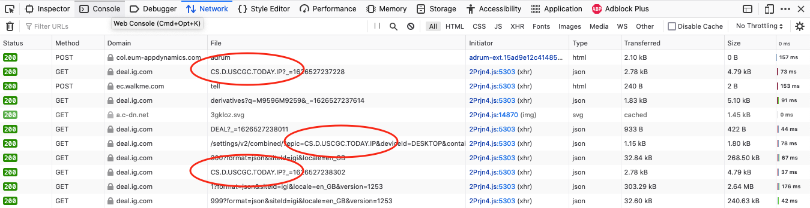

FAQs
====

Why are there multiple versions of some API endpoints?
--------------------------------------------------------
IG have updated their API endpoints at various times, and they do not close down the older ones - presumably
to not break anyone's applications. They have been updated for various reasons, including

* to support UTC time stamps
* to offer more options
* to include paged sets of results
* to incorporate multiple features into one endpoint

Generally a higher version number is better - the exception is session creation, see :ref:`here <v2_or_v3_sessions>`

Are there any code samples?
---------------------------
There are a few simple ones in the :doc:`Quickstart <quickstart>`. There are also a few in the ``/sample``
directory, see :ref:`here <samples>`. And there are a lot of usage samples in the unit and integration tests.

There are not many samples using the Streaming API. If you use the Streaming API, please consider contributing.

.. _samples:

How do I run the code samples?
------------------------------

For the REST API sample - from the project root, run::

    $ python sample/rest_ig.py

For the streaming sample, run::

    $ python sample/stream_ig.py

In both samples there are commented lines with alternative CFD epics

How to see log messages from ``ig_trading``?
--------------------------------------------

In your code, do something like::

    import logging

    logging.basicConfig(
            level=logging.INFO,
            format='%(asctime)s %(levelname)s %(message)s',
            datefmt='%Y-%m-%d %H:%M:%S')

    logging.info("Log something")

Why did I get a ``KeyError: CST``?
----------------------------------
``CST`` is the name of one of the HTTP headers returned in the response from IG on successful connection. If
you see this error it probably means your username, password or API key is wrong. Or that you are
using the DEMO credentials to connect to the LIVE account, or vice versa.

.. _rate_limits:

Why do I get a error like ``error.public-api.exceeded-*-allowance``?
-------------------------------------------------------------------------------

The IG APIs have rate limits; you can only make a certain number of requests during a certain time period
(eg minute, hour, week etc) depending on the request type. The four error types are:

* ``error.public-api.exceeded-api-key-allowance``
* ``error.public-api.exceeded-account-allowance``
* ``error.public-api.exceeded-account-trading-allowance``
* ``error.public-api.exceeded-account-historical-data-allowance``

The limits for the LIVE environment are published `here <https://labs.ig.com/faq>`_, but the limits for DEMO are
lower, and have been known to change randomly and without notice. If you see one of these errors, you have
exceeded one of the limits.

How to avoid hitting the rate limits?
-------------------------------------

There are two options. The first is manage it yourself with your own code. Since version 0.0.10, ``trading_ig``
has support for `tenacity <https://github.com/jd/tenacity>`_, a general purpose retrying library. You can initialise
the ``IGService`` class with a ``Retrying`` instance, like::

    from trading_ig.rest import IGService, ApiExceededException
    from tenacity import Retrying, wait_exponential, retry_if_exception_type

    retryer = Retrying(wait=wait_exponential(),
        retry=retry_if_exception_type(ApiExceededException))
    ig_service = IGService('username', 'password', 'api_key', retryer=retryer)

The setup above would capture any exceptions caused by exceeding the rate limits, and repeatedly retry, waiting
an exponentially increasing time between attempts - until successful. Note that any historical data allowance
rate limit would not be re-attempted.

See the integration and unit test for examples, and the `tenacity docs <https://tenacity.readthedocs.io/en/latest/>`_
for more options

Why do see an error like ``REJECT_CFD_ORDER_ON_SPREADBET_ACCOUNT``?
-------------------------------------------------------------------
If you are attempting to open a spread bet OTC position with code like

>>> resp = ig_service.create_open_position(
    currency_code='GBP',
    direction='BUY',
    epic='CS.D.USCGC.TODAY.IP',
    order_type='MARKET',
    expiry='-',
    force_open='false',
    ...

you will see this error. CFD bets should have::

    expiry='-'

but spread bets must have::

    expiry='DFB'

or, for futures or forward bets, something like::

    expiry='SEP-21'

Why does my Lightstreamer connection fail after 2 hours / every day?
--------------------------------------------------------------------

This problem has come up many times, and there is not really a good solution yet. Have a look at the discussions in
these issues:

* `Issue 84 <https://github.com/ig-python/ig-markets-api-python-library/issues/84>`_
* `Issue 182 <https://github.com/ig-python/ig-markets-api-python-library/issues/182>`_

Contributions welcome!

Why do see an error like ``public-api.failure.stockbroking-not-supported``?
---------------------------------------------------------------------------------
With the v1 and v2 session endpoints, you only need to specify a username, password and API key to
create a session. The APIs only work with spread bet and CFD accounts, but IG offer all sorts of other
accounts, eg ISA, SIPP, share trading etc. As a result, IG defines a *default account* for you, which you can
change in preferences (or with the API). You will see this error if your default account is set to
ISA, SIPP or share trading, and you attempt to login to the API with a v1 or v2 session. There are two
solutions:

- change your default account to your spread bet or CFD account. From the web interface, go

  - `My IG > Settings > Default view`

- switch to v3 sessions. see :ref:`here <v2_or_v3_sessions>`

.. _running_tests:

How do I check my PR will pass CI checks?
-----------------------------------------
This project uses some automated continuous integration (CI) processes whenever any code is committed, or if someone
creates a PR. There are unit tests, and linting with ``flake8``. In addition, an integration test gets executed
every night. The integration test takes a long time due to the :ref:`rate limits<rate_limits>`. Before
making a PR, please make sure the tests pass. For linting::

    $ poetry run flake8 trading_ig

for unit tests::

    $ poetry run pytest --ignore=tests/test_integration.py

for integration tests::

    $ poetry run pytest tests/test_integration.py

for unit and integration tests::

    $ poetry run pytest

for all tests, including one *really* long running one that tests v3 sessions::

    $ poetry run pytest --runslow

.. _v2_or_v3_sessions:

Should I use v2 or v3 sessions?
-------------------------------
Short answer: stick with v2 if you can.

Longer answer (read the `IG guide <https://labs.ig.com/rest-trading-api-guide>`_ first):
v1 and v2 sessions are much simpler. Tokens from these sessions are initially valid for 6 hours, but then
get extended while in use. This means once a session has been authenticated, your app will continue to be able
to make requests indefinitely, as long as you make a request every few hours, say. You would only need to
re-authenticate if your connection was reset, for example. Once authenticated with one of these sessions,
the active account (eg spread bet, CFD) will be the one defined as your *default account*. You can then switch to
another account using ``switch_account()``, if needed.

v3 sessions (IG calls them ``OAuth``, but they are not) are completely different. v3 session tokens expire after
1 minute, which means there is much more work needed under the hood the manage the connection. Internally,
this library checks before each request to see if the session needs to be refreshed, or if a new one is needed. The
implementation is newish (April 2021) and is relatively untested. With v3 sessions, you specify which account you wish
to connect to at the time of ``IGService`` creation.

There is one use case where you *must* use v3 sessions (at least so far discovered). If you use both IG's
`L2 Dealer <https://www.ig.com/uk/trading-platforms/l2-dealer>`_ product for buying and selling shares or CFDs,
*and* you have an application connecting to the APIs, then your app will need to use v3 sessions. *L2 Dealer*
requires your default account to be set to ISA, SIPP, etc.

How do I connect with a v3 session?
-------------------------------------

With v3 sessions, you must also supply the account you wish to connect to, use the ``acc_number``
parameter. You also need to specify ``version='3'`` in the ``create_session()`` call

>>> from trading_ig.rest import IGService
>>> from trading_ig.config import config
>>> ig_service = IGService(
        config.username,
        config.password,
        config.api_key,
        config.acc_type,
        acc_number=config.acc_number)
>>> ig_service.create_session(version='3')

.. _report_problem:

What if I have a problem?
--------------------------

If you have a problem using this library, the first thing to do is to try to isolate where the problem is. The IG
platform is a complex application, and there are many ways to make mistakes using it. Just because you see an error,
it does not necessarily mean there is a problem with this library. If you encounter an issue, you should follow these
steps, in order:

1. Check if there a problem with the IG platform. From time to time the IG platform itself has issues, especially the
DEMO environment. If you see a message like `ConnectionRefusedError`, or a 500 Server error, then it could be an issue
with the IG platform. IG provide a `status page <https://status.ig.com/>`_, though its accuracy is questionable. You
can also check the `IG Community forums <https://community.ig.com/>`__. If there are platform issues, its likely someone
will have already posted a message there.

2. Check if there is a problem with your code. Most of the API endpoints have multiple options, multiple versions,
multiple ways of accessing them, and multiple interdependent parameters. Incoming data is validated on the server, and
problems will be reported back in the response. You should

    * check the documentation (`REST <https://labs.ig.com/rest-trading-api-reference>`__,
      `Streaming <https://labs.ig.com/streaming-api-reference>`__) to make sure you are calling the APIs correctly
    * look at the `sample code <https://github.com/ig-python/ig-markets-api-python-library/tree/master/sample>`_ and
      `unit and integration tests <https://github.com/ig-python/ig-markets-api-python-library/tree/master/tests>`_.
      There are example snippets for most API endpoints.
    * repeat the API call using the IG companion tools (`REST <https://labs.ig.com/sample-apps/api-companion/index.html>`__,
      `Streaming <https://labs.ig.com/sample-apps/streaming-companion/index.html>`__). If you get the same result, then
      it is likely that you are using the API incorrectly.

    Unfortunately, the people who maintain this library do not have time to provide support. In this case you should:

    * read the IG docs more carefully, or
    * post a question in the `IG Community site <https://community.ig.com/>`__, or
    * contact the `API support team <mailto:webapisupport@ig.com>`_

3. If you're sure that the problem is with this library, please:

    * provide *everything* necessary to reproduce the problem
    * include the full script that produces the error, including import statements
    * ideally this should be a *minimal example* - the shortest possible script that reproduces the problem
    * dependencies and their versions
    * the full output trace including the error messages

An issue without all this information may be ignored and/or closed without response

What happened to ``setup.py`` and ``requirements.txt``?
-------------------------------------------------------------
Early versions of this project used the standard ``setup.py`` config, with a ``requirements.txt`` file describing
dependencies. `Poetry <https://python-poetry.org/>`_
support was added with version 0.0.10 (July 2021). The old style config was removed with version 0.0.14

.. _why-is-pandas-an-optional-dependency-in-pyproject-toml:
.. _optional-dependencies:

Why are some dependencies marked as optional in ``pyproject.toml``?
-------------------------------------------------------------------

Flexibility:

* The original intent of the project was that ``pandas`` and ``munch`` usage was optional. At a low level the
  IG APIs return JSON data in the response body; this project aims to be a flexible as possible in how
  applications use that data. If your project has pandas available, then the data will be converted into a pandas
  DataFrame where it makes sense to do so. Time series data for example, like historical price data, or account
  activity. If not, it returns a dict of the response data. It's the same for munch - fetching market info for a
  given epic will return a munch object if that library is available in your environment, or a dict if not

* if this project is defined as a dependency in a higher level project (ie as a library), it should not
  define which version of pandas is used. That should be defined in the parent project

* ``tenacity`` support was added in version 0.0.10 as one possible way to handle the IG rate limits. However, it
  is a brute force method, effectively waiting an ever increasing amount of time between attempts until a request
  succeeds. It works well for the nightly integration test, where time taken is not important, but
  for high speed trading with real money it may not be be best solution. There are many other ways to handle the
  limits, and each will depend on the characteristics of the application. To be as flexible as possible for users
  of this project, tenacity is also marked optional

How do I find the epic for market 'X'?
--------------------------------------

There are a few different ways:

1. Use the `REST API Companion <https://labs.ig.com/sample-apps/api-companion/index.html>`_. This is a good
tool to get familiar with anyway, if you want to learn about the IG APIs. Login, then use the *Search Markets*
part, enter your search term, and press *Go*. The results will show any markets that match the search term you
entered, and *epic* is one of the attributes displayed in the results. Its a simple text search though, there's
no way to filter.

2. Use this library, see method ``IGService.search_markets()``. This is the same function that sits behind method
1 above.

3. (Recommended) Use the IG website. Login to the IG site, and show developer tools (`Chrome
<https://developer.chrome.com/docs/devtools/network/>`_, `Firefox
<https://developer.mozilla.org/en-US/docs/Tools/Network_Monitor>`_) in your browser, with the network tab
selected. Internally, the IG website content is driven by a version of the same API, the URLs are similar. So,
navigate to the market you want to find the epic for, then check the network tab. The URL will contain the epic, eg
for the URL::

    https://deal.ig.com/nwtpdeal/v2/markets/details/CS.D.USCGC.TODAY.IP?_=1626527237228

The epic is *CS.D.USCGC.TODAY.IP*. See screenshot:

4. The REST API has two methods that can be used to replicate the navigation tree used on the IG website -
``fetch_top_level_navigation_nodes()`` and ``fetch_sub_nodes_by_node()``. There is also a script in the ``/samples``
directory that shows how these functions *could* be used to traverse the entire tree. However, this is not recommended;
the tree is HUGE, and it would take days to traverse the entire tree due to the rate limits.

Why do see an error like ``unauthorised.access.to.equity.exception``?
---------------------------------------------------------------------

It is not really clear what this means. It can currently (July 2021) be seen if attempting to
get historic prices for the Volatility Index (VIX) futures spread bet. On querying the API support
team, their response was:

    Our developers and dealing desk looked into the issue and  VIX data should not be available on web api at all.
    The VIX data feed is similar to the shares datafeed. The error you received on the futures (feb , mar etc)
    is correct and the cash should also be disabled. Our developers have an existing project to bring the Cash
    epic in line with the future contracts but going forward you would not be able to download data on any of the
    VIX epics using API.

